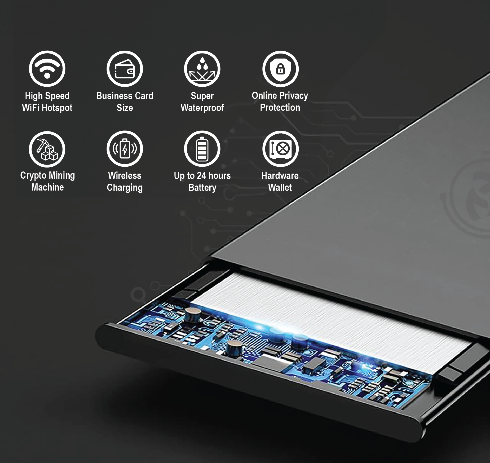

# CONET Power Card

<figure><figcaption></figcaption></figure>

CONET提供信用卡尺寸，只有6張信用卡厚度的超薄，可放入錢包的個人WiFi隨身智能硬件設備，在其网络覆盖半径内，使用者不仅可以无缝进行网络传输，还提供强大的隐私保护。它還可以作為CONET入網設設備提供商，賺取額外收益。

**技術規格**

* **無線WiFi：**802.11a, b, n
* **芯片：**2x高通64位 Core
* **操作系統：**優化訂製Debian
* **可選存儲容量：**512GB/1TB
* **電池：**最長工作時間達24小時，一週待機
* **充電：**無線充電。兼容任意無線充電器
* **CONET代理：**原生支持[CONET代理服務](web2-qiao-jie.md)，獲得隱私自由的上網
* **隱私存儲協議：**支持CONET獨特碎片化加密
* **密碼保護協議：**使用抗暴力破解Scrypt衍生協議，由客戶端簡單密碼，產生256位高強度密碼保護
* **硬件錢包技術：**碎片化加密後分佈存儲的私鑰，攻擊者就算攻入CONET硬件設備，都無法找到私鑰

**物理規格**

* **尺寸：**5cm x 9cm x 0.6cm (2 x 3.5 x 0.25 in)
* **重量：**50克 (1.6盎司)
* **材料：**超瓷晶面板
* **外部按鈕，端口：**無任何接口和按鈕
* **防塵防水：**全封閉結構，超級防水防塵
* **其他：**符合US能源部要求，100%環保可再生材料
